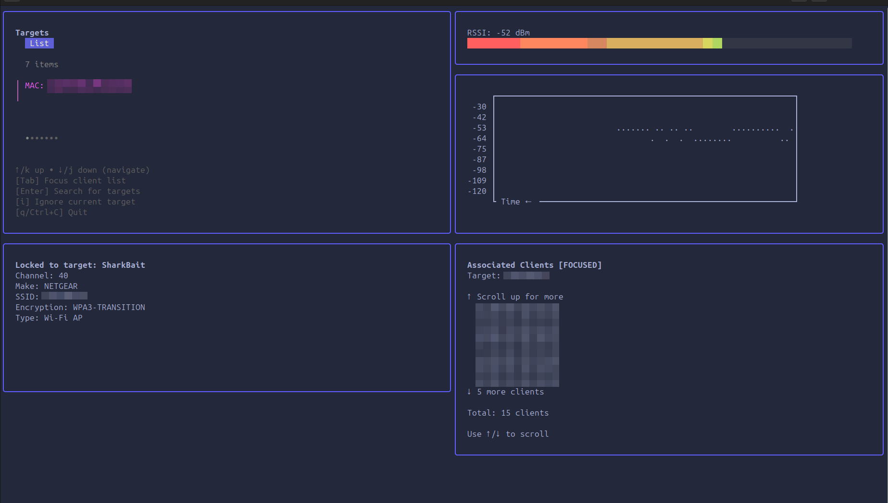

# Rizzyscope



## Overview

Are you tired of that pesky neighbor sending **deauths** all over the place? Do you want to catch him in the act with your trusty **Yagi antenna**, pinpoint his location and wave? Or maybe you're more of a sit-back-and-relax type who prefers to passively hang out on a channel and collect **EAPOL** messages like they’re going out of style? Maybe you're on a mission to find that rogue AP that popped up out of nowhere. Well, **Rizzyscope** has got you covered!

**Rizzyscope** is the tool you didn’t know you needed to interact with the **Kismet wireless network detector**. It allows you to monitor the **RSSI (Received Signal Strength Indicator)** of a specific MAC address right in your terminal, turning your humble computer into a deauth-hunting, rogue AP-finding, packet-sniffing machine. Whether you're on a mission to track down malicious devices or just having some fun monitoring the airwaves, Rizzyscope makes it easy.

## Features

- **Automatic Kismet launch:**  Who wants to manually start Kismet? Not you. Let Rizzyscope handle that for you automatically. Rizzyscope automatically launches Kismet, eliminating the need for manual startup.
- **MAC address monitoring:** Got a pesky neighbor’s device or rogue AP you want to track? Just plug in their MAC address and let Rizzyscope work its magic through the Kismet API. The program searches for the specified MAC address via the Kismet API.
- **Channel locking:** Once your target is in sight, Rizzyscope locks onto the channel like a heat-seeking missile—no distractions, just raw signal strength. Once the MAC address is found, Rizzyscope locks onto the channel of that device.
- **Real-time RSSI display:** Visualize the RSSI values in real-time within the terminal using a progress bar.
- **Configurable via TOML file:** Don’t like typing long commands? Simply configure Rizzyscope via the config.toml file, and you’ll be up and running in no time. (Even faster than your neighbor can say "deauth.") Rizzyscope can be configured using a `config.toml` file for easy setup.
- **Command-line overrides:** Feeling fancy? Override your configuration settings directly from the command line, because who doesn’t like the power of options? Users can override configuration file settings directly via command-line arguments.

## Requirements

- **Kismet**: Rizzyscope requires Kismet to be installed on your machine. Kismet is a wireless network and device detector, sniffer, wardriving tool, and WIDS (Wireless Intrusion Detection) framework. Ensure that Kismet is installed and accessible in your system's PATH.
- **Go**: Ensure that Go is installed on your machine.
- **Root access**: The program needs to be run with root privileges to interact with network interfaces.

### Installing Kismet

To install Kismet, follow the instructions on the [official Kismet website](https://kismetwireless.net/).

## Installation

### Download the Latest Version

You can download the latest version of Rizzyscope from the [Releases](https://github.com/GobiasSomeCoffeeCo/rizzyscope/releases) page on GitHub. Download the binary for your operating system, extract it, and you’re ready to go.

### Building from Source

If you prefer, you can build Rizzyscope from source:

1. **Clone the repository**:
```bash
git clone https://github.com/GobiasSomeCoffeeCo/rizzyscope.git
cd rizzyscope
```
   
Build the program:

```bash

go build -o rizzyscope
```
## Usage
### Running the Program

Rizzyscope can be run with either a configuration file or command-line arguments. If both are provided, command-line arguments will override the configuration file settings.

#### Example 1: Using a Configuration File

Create a config.toml file in the same directory as the executable:

```toml

[required]
target_mac = ["12:34:56:AA:CC:EE","22:34:56:bb:cc:ee","554456BBCCEE","ab3423febc3d"]
interface = ["wlp0s20f0u2u3", "wlp0s20f0u2u4"]

[optional]
target_ssid = ["TPLink", "UrWifi", "MyWifi", "NotUrWifi"]
kismet_endpoint = "127.0.0.1:2501"

# Kismet Credentials
[credentials]
user = "test"
password = "test"
```
#### Run the program:

```bash

sudo ./rizzyscope
```
#### Example 2: Overriding Config with Command-Line Arguments

You can override the mac and interface settings using command-line arguments:

```bash

sudo ./rizzyscope -m 11:34:56:23:23:EE,22:34:56:BB:BB:EE,33:34:56:BB:BB:EE -i wlp0s20f0u2u3
```
#### Example 3: Specifying a Different Config File

You can specify a different configuration file using the -c flag:

```bash

sudo ./rizzyscope -c /path/to/your/config.toml
```
#### Example 4: Implement --skip-kismet flag to use existing Kismet instance

You can specify a different configuration file using the -c flag:

```bash
sudo ./rizzyscope --skip-kismet 
sudo ./rizzyscope -k

```
Configuration

The program can be configured via a TOML file. The default configuration file is config.toml in the current directory.
Configuration File Structure

```toml
[required]
target_mac = ["12:34:56:AA:CC:EE","22:34:56:bb:cc:ee","554456BBCCEE","ab3423febc3d"] # Target MACs
interface = ["wlp0s20f0u2u3", "wlp0s20f0u2u4"] # Supports multiple interfaces

[optional]
target_ssid = ["TPLink", "UrWifi", "MyWifi", "NotUrWifi"] # Target by SSID
kismet_endpoint = "127.0.0.1:2501" # Where you want to point the kismet enpoint

# Kismet Credentials
[credentials]
user = "test"  # Your kismet username
password = "test" # Your kismet password

```
## How It Works

- **Launch Kismet**: Rizzyscope automatically starts Kismet on the specified network interface.
- **Search for MAC Address**: The program queries the Kismet API to find the specified MAC address.
- **Lock to Channel**: Once the MAC address is detected, Rizzyscope locks the network interface to the appropriate channel.
- **Real-Time RSSI Display**: The RSSI for the MAC address is displayed in real-time using a terminal-based progress bar.


## Output

When running, the program will display a real-time progress bar in the terminal, representing the RSSI value of the specified MAC address.

For questions or issues, please open an issue on the GitHub repository.
